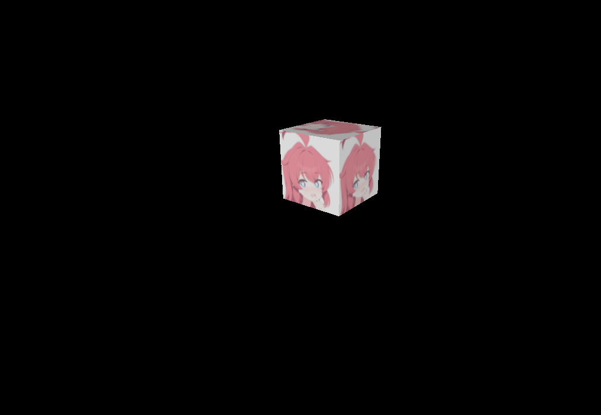
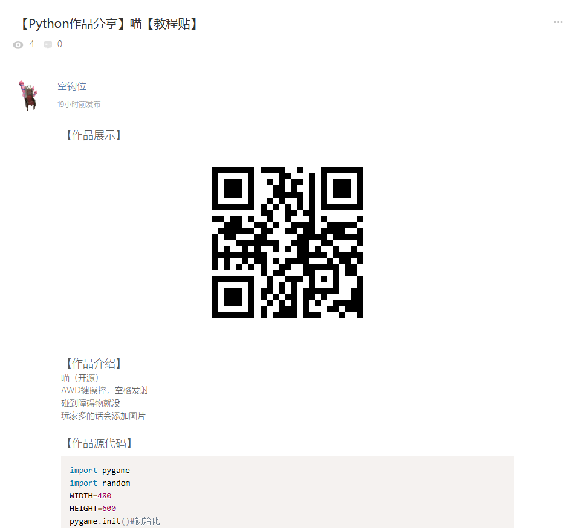

# 代码诗人

一个让人感觉诗人我吃

## 虚数快乐站

**作者**:xiaole233

**链接**:[Github仓库]() [在线体验](https://imgainary-number-happy-site.pages.dev/)

**介绍**：掉落物形态的虚数！

**编辑评**：猫站3D第一人必须要以3D形式挂在网页上！

**虚数**：你学3D就为了这个是吧（

## 请输入文本

**作者**：空钩位

**链接**：[社区](https://shequ.codemao.cn/community/1634692)

**介绍**：作者并没有提供完整的代码，根据代码片段来看，应该是一个打陨石相关的PyGame小游戏

**编辑评**：我感觉应该会很有创意，另一方面，猫站用Python做游戏的人确实很少
