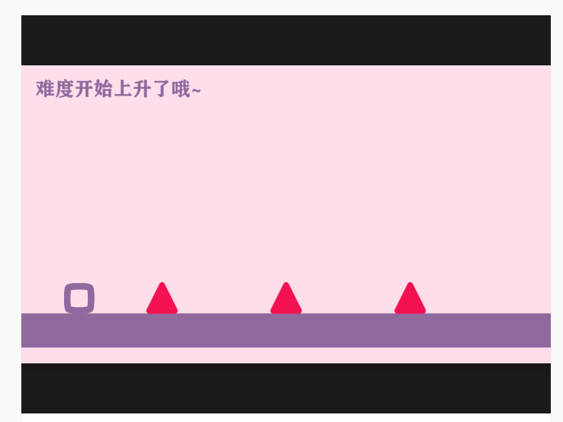
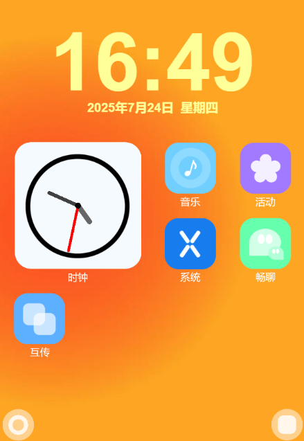

# 积木纪元

今天刊登的作品共同点为动效如同注入了德芙巧克力，丝般顺滑，如同使用了CSS

## [紫de跑酷](https://shequ.codemao.cn/work/246124060)

**介绍**：一个使用Kitten制作的简单的方块跑酷小游戏，创意很好，并且残影效果和动效都看起来很舒服，并且，该作品是这位作者的第一个作品，值得各位的鼓励

**编辑评**：八年老油条编辑自愧不如

## [XiaoyuOS 4](https://shequ.codemao.cn/work/257012292)

**介绍**：一个用kitten模拟的手机操作系统，动效丝滑，甚至比我用CSS3写出来的动画还要舒服

**编辑评**:疑似余承东本人制作

