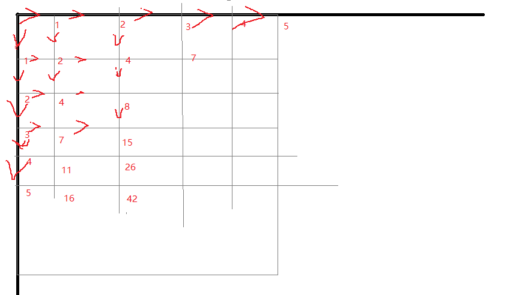

# 传火者 - 来教你手撕过河卒

过河卒，一道递推入门题，但在洛谷的题目编号是 P1002，也就是第三个题，这题的编号让追梦者直呼：我写的 P1002 不就差了 1 位么，我跳一关就那么难？最终他的测试点情况为 2AC,3TLE 所以我就写了这么一篇教程来教各位如何手撕这道递推入门题。

## 思路分析

题目要求我们求出卒从(0,0)到达(n,m)这一点的可行的路径，路线不能经过马和马能攻击到的点。

这题我们首先想到的方法是回溯搜索，但棋盘最大为 20x20，使用 DFS 显然会超时。那我们或许可以找一找 n,m 与总的路径个数的关系。我们先来分析没有马的情况，一个 5x5 的棋盘下，到达个点的可行条数如下图所示：

我们把每个点可行的路线放在一张表里，表的坐标与坐标系里的坐标严格对照：
|0|1|2|3|4|
|-|-|-|-|-|
|1|2|4|7|11|
|2|4|8|15|26|
|3|7|15|30|56|
|4|11|26|56|112|
|5|16|42|98|210|

发现规律了吗？若可行的路线数为$f$，则
1. 当x或y为0时，$f=x$或$f=y$
2. 当x或y不为0时，这个格子的数字等于它上方的哪一个格子的数字加左边的那一个格子的数字。

若这张表为二位数组f[i][j]，则这个数组中的元素满足该表达式
$$$
f[i][j]=f[i-1][j]+f[i][j-1]
$$$

然后我们开始考虑马的问题。这个也十分简单，马的位置和马能攻击的坐标无法到达，也就是这些点的可到达总路线为0。在程序开始时我们把这些地方填成0就行了.

## 代码实现

``` python
def count_paths(n, m, horse_x, horse_y):
    # 初始化棋盘，标记障碍位置
    blocked = [[False]*(m+1) for _ in range(n+1)]
    # 马的位置和攻击位置
    moves = [ (1,2),(2,1),(-1,2),(-2,1),
              (1,-2),(2,-1),(-1,-2),(-2,-1) ]
    
    blocked[horse_x][horse_y] = True
    for dx, dy in moves:
        x, y = horse_x + dx, horse_y + dy
        if 0 <= x <= n and 0 <= y <= m:
            blocked[x][y] = True
    
    # 初始化DP表
    dp = [[0]*(m+1) for _ in range(n+1)]
    dp[0][0] = 0 if blocked[0][0] else 1
    
    # 处理第一行和第一列
    for i in range(1, n+1):
        dp[i][0] = 0 if blocked[i][0] else dp[i-1][0]
    for j in range(1, m+1):
        dp[0][j] = 0 if blocked[0][j] else dp[0][j-1]
    
    # 填充DP表
    for i in range(1, n+1):
        for j in range(1, m+1):
            if blocked[i][j]:
                dp[i][j] = 0
            else:
                dp[i][j] = dp[i-1][j] + dp[i][j-1]
    
    return dp[n][m]

inp=input().split(" ")
n=int(inp[0])
m=int(inp[1])
horse_x=int(inp[2])
horse_y=int(inp[3])
print(count_paths(n, m, horse_x, horse_y))
```