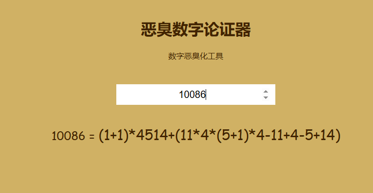

# 代码诗人

## 数字恶臭化论证器

**作者**:itorr

**介绍**:一个将任意数字分解成 114514 构成的公式的工具。

**创意**:114514/5

**完成度**:114514/5

**评价**:哼哼哼啊啊啊啊啊

**链接**:[Github](https://github.com/itorr/homo) [在线体验](https://lab.magiconch.com/homo/)

## 2D联机游戏

**作者**:winXP11242

**介绍**:基于Socket和Pygame的C/S架构的2D联机小游戏

**创意**:3/5

**完成度**:2/5

**评价**:用Socket已经很强了，但编辑我找不到人和我一起玩（（

**链接**:[客户端](https://shequ.codemao.cn/community/1634916) [服务端](https://shequ.codemao.cn/community/1634914)

