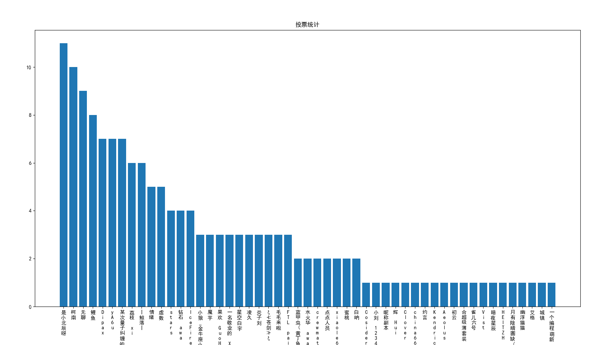

# 编辑部专版 

## 我们写稿的原则

各位读者们：猫站小报成功出版三期，这令人欣喜。但撤硕儿板块所观察到的一些社区现象和该板块引起的社区讨论让我认为有必要简述我们写稿的原则，我希望我们的读者也会遵守这些原则

- **永不参与鉴证** 这里的鉴证不仅限于时政新闻，也包括社区内的争论
- **技术实用主义** 我们侧重于技术的应用，不会涉及到太复杂的计算机科学理论。如果您懂这些技术的计算机科学原理，欢迎在帖子下补充！
- **原创优先原则** 我们鼓励原创，投稿的原创作品优先刊登，同质化的作品少刊登
- **发扬协作精神** 小报的所有源代码均开放于 Github,你可以参与协作
- **保护社区生态** 鼓励本社区内的技术创新、创意作品，反对社区内斗
- **欢乐即为力量** 同样鼓励适度的社区娱乐内容，但不鼓励让娱乐内容顶替技术内容
- **伦理红线** 我们不会刊登任何会引发有违道德的技术，讨论只针对社区现象而不是社区中的人

同样，我们也请各位读者们思考：

- **在社区争论是否有意义**
- **创作真的有标准答案吗**
- **你在社区里的讨论真的有助于原创作者们的继续创作吗**
- **你会接纳他人的观点吗**
- **在社区里娱乐的目标是什么**

我们也建议**所有的读者**

- 停止内斗，回归创作
- 鼓励创作，反对同质化
- 有限社区娱乐
- 思考技术伦理

**所有的创作者**

- 抛弃“标准答案”，回归创作本源
- 努力学习，提升技术力
- 分享技术，提升整体技术水平

希望各位能够持续创作优秀作品，提升自己的技术力，实现猫站的再次伟大

## 猫舍重新选举
昨日2025/7/25猫舍重新进行管理员选举，在此次选举中共投出35票，得票情况如下：



本届管理员名单
```
是小北辰呀：11 票
柯南：10 票
无聊：9 票
鲤鱼：8 票
Dipax：7 票
yA6u：7 票
某次量子纠缠的降雨：7 票
荔枝 xi：6 票
丨鲸落丨：6 票
情绪：5 票
虚数：5 票
stars：4 票
钻石 awa：4 票
IceFire 冰火：4 票
```

同时，群主Mecat指出猫舍和编程猫切割，吸纳更多的用户，这让人担心猫舍是否会进一步失去技术交流价值