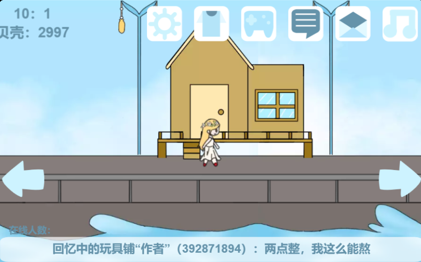

# 积木纪元

以后会对作品的创意和完成度进行评分，满分均为五分

## [庄园纳凉夜-夏日小镇[未完成]](https://shequ.codemao.cn/work/276573642)

**作者**:回忆中的玩具铺

**介绍**：操控“小女孩”在夏日小镇游玩，目前尚未完成

**创意**:4/5

**完成度**:1/5

**评价**:我比较喜欢这个美术风格，相信完成之后会比较有意思

## [球球学院](https://shequ.codemao.cn/work/232736870)

**作者**:SOVIET苏大林.苏哥

**介绍**：动画向作品，描绘了球球学院

**创意**:3/5

**完成度**:3/5

**评价**:做成游戏会不会更有趣呢？

