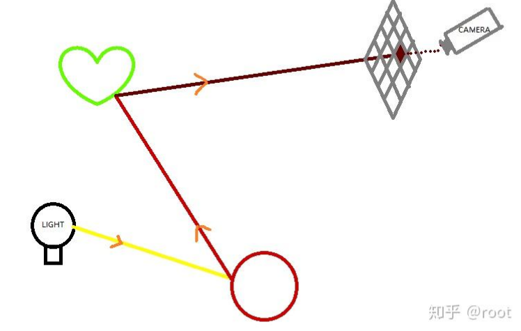
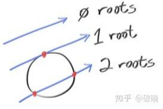
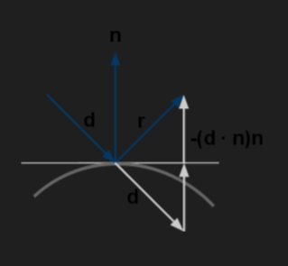

# 传火者

## 【RTX ON】实现你的第一个光线追踪(理论准备)

### 1.基础知识

#### 1.1 向量

向量是具有方向和大小的量，在实际中一般用有序数对表示，如$(1,2)$表示一个 $x$ 坐标为 $1$、$y$ 坐标为 $2$ 的二维向量，$(1,2,3)$表示一个 $x$ 坐标为 $1$、$y$ 坐标为 $2$、$z$ 坐标为 $3$ 的三维向量。当向量用字母表示时，印刷体记作粗体，如 a。 向量的加减法就是有序数对中对应位置的数相加，得出的结果是一个向量。向量的点积(或称为数量积)是两个向量对应位置的数相乘后相加，得出的结果是一个数。

$$
a=(x_a,y_a,z_a),b=(x_b,y_b,z_b)
$$

$$
加减法：a\pm b = {x_a\pm x_b,y_a\pm y_b}
$$

$$
数量积:ab=x_a x_b + y_a y_b +z_a z_b
$$

向量的模即为向量的长度，用勾股定理即可算出。$c$ 单位向量即为模为 $1$ 的向量

$$
\vert a \vert = \sqrt{x_a^2+y_a^2+z_a^2}
$$

#### 1.2 什么是渲染？

渲染是从三维模型生成二维图像的计算过程，这是一个降维的过程，需要将制作的模型经过纹理、灯光得到最终的效果。一般而言，光线追踪时要遍历屏幕上的每一个点，获取经过该点和相机的光线的颜色，然后显示在屏幕上。

### 2.光线追踪算法

#### 2.1 光线追踪

光线追踪，顾名思义就是跟着光线走，模拟光线的物理行为，如反射、折射等。跟着一条光线，从光源出发，击中物体，发生反射或折射，最终到达相机，形成影像，这就是一条光线的历程。如果从光源发射大量光线，经过模拟后屏幕上将会形成一幅真实的影像，这是因为我们几乎完全模拟了光线的物理行为，得到的影像也就和现实相差无几。

但我们很快发现这是很慢的，因为从光源出发的光线经过反射、折射后大部分都不能到达相机(相机只是一个视点)，很多光线都浪费了，造成了大量的计算损失！但好在光路是可逆的，我们完全可以反向追踪光线，从相机向屏幕上的一个像素点发射光线，击中物体后反射，直到碰到光源。这条光路与正向追踪时是一样的，大大地减小了计算量。

#### 2.2 光线的向量表示与计算

在光线追踪中，我们一般认为光线以直线传播，可以用下面的参数方程表示。

$$
p=o+td
$$

其中，$p$ 表示光线上的点，$o$ 表示光线的起点，$t$ 表示光线的长度，$d$ 表示光线的单位向量。值得注意的是，光线是射线，故 $t$ 应该大于等于零。图中的 $t \cdot d$ 为向量的数乘。 接下来需要给场景添加一些物体，这里我们从最简单的球体开始。根据球面的定义，可以很快的写出球面的向量表示。

$$
\vert \vert p-c \vert \vert = R
$$

$c$ 表示球心，$R$ 表示球面半径，$p$ 表示球面上的点。两条式子都有 $p$，且未知数只有 $t$ ，这里我们把光线的参数方程代入球面方程中得：

$$
\vert \vert o+td-c \vert \vert = R
$$

等式两边同时平方得：

$$
(td+o-c)^2=R^2
$$

$$
\vert d \vert^2 \cdot t^2+2\cdot [(o-c)\cdot d]\cdot t+(o-c)^2-R^2=0
$$

很明显这是一个一元二次方程，首先写出它的 $\Delta$：

$$
\Delta=4\cdot [(o-c)\cdot d]^2-4 \vert d \vert ^2 \cdot [(o-c)^2-R^2]
$$

对于 $\Delta$ 有三种情况，分别是 $\Delta < 0, \Delta = 0, \Delta > 0$，对应着光线与球面没有交点、有一个交点、有两个交点。

有了 $\Delta$ 后，就可以计算出 $t$ 了：

$$
t=\frac{-(o-c)\cdot d \pm \sqrt{\Delta}}{2 \cdot \vert d \vert ^2}
$$

这里的 $t$ 取较小的一个，因为距离较远的点被球面遮挡。

#### 2.3 漫反射和反射

通过已知的 $t,o,d$ 可以计算出光线与球面最近的交点 $p$，$(p - c)$就是球面在 $p$ 点处的法向量 $n$(此处法向量必须化为单位向量)。根据反射角等于入射角的规律，我们不难注意到反射光线 $r$ 与 $n,d$ 有以下关系：

$$
r=d-(d \cdot n)n
$$

同时交点 $p$ 成为新的光线起点，$r$ 成为新的光线向量，继续与其它物体进行求交、反射，直到击中光源或反射次数过多能量衰减到几乎为零。 而漫反射实际上是指光线照射到粗糙表面时，光线向各个方向反射的现象，反射的方向基本上没有什么规律，但一定要在当前法向 $n$ 的半球内随机反射，然后继续与其它物体进行求交、反射，直到击中光源或反射次数过多能量衰减到几乎为零。

> 原作者：虚数

> 原帖地址:https://shequ.codemao.cn/community/1634586

> 数学公式排版十分困难，我花费了半个小时才排版好
