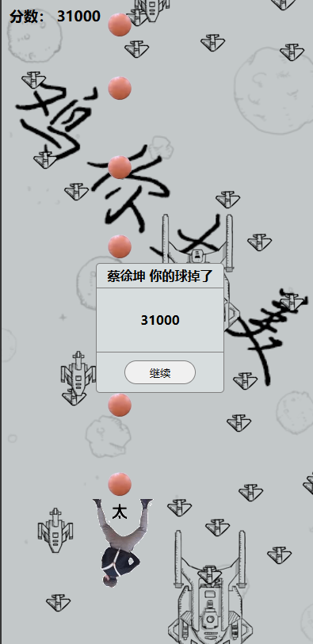
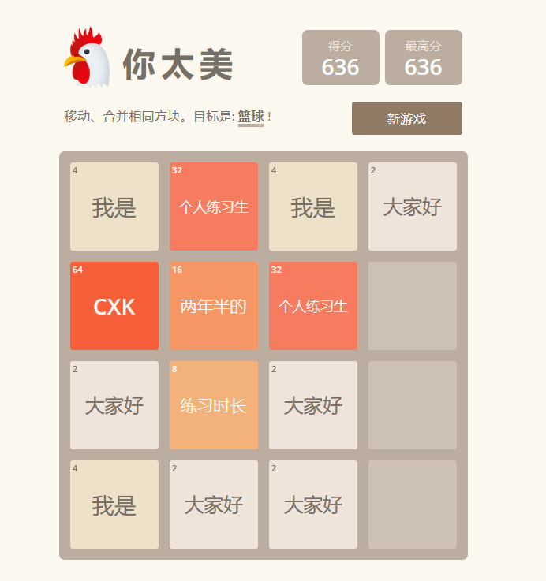

# 代码诗人
我足足找了2.5天！
## cxk打飞机

**作者**:Enaium

**介绍**:我不好说

**创意**:2.5/5

**完成度**:2.5/5

**评价**:？

**链接**:[Github](https://github.com/Enaium/cxk-ball-hitplane) [在线体验](https://enaium.github.io/cxk-ball-hitplane/)

## 鸡你太美2048

**作者**:ZKLlab

**介绍**:一个魔性又吵闹的2048小游戏。

**创意**:2.5/5

**完成度**:2.5/5

**评价**:鸡你太美！

**链接**:[Github](https://github.com/ZKLlab/cxk-2048-react) [在线体验](https://jntm.zkllab.com/)

