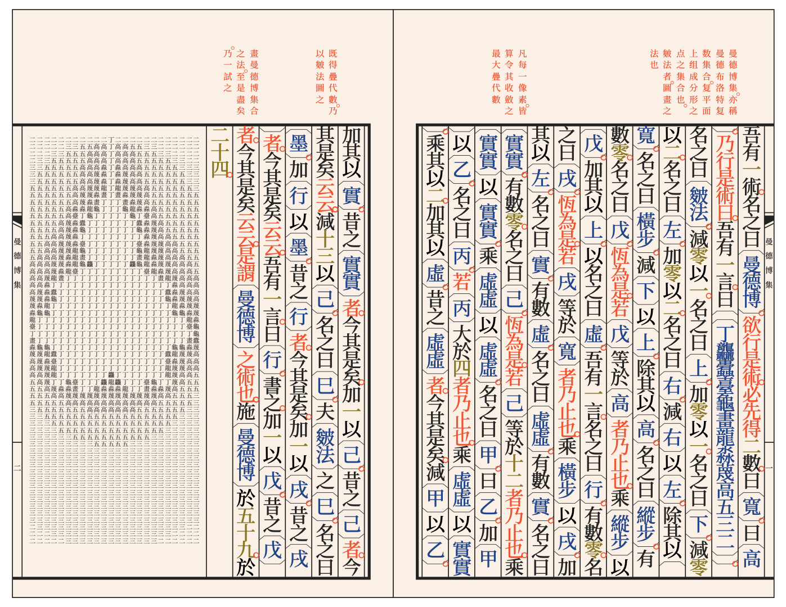
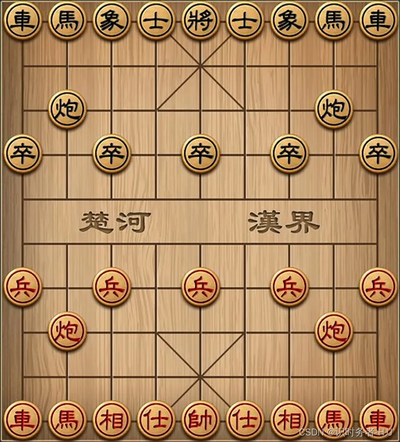

# 代码诗人

## 文言

**作者**:wenyan

**介绍**:文言文代码，一门深奥编程语言，是JS的一个变种

**创意**:伍又伍

**完成度**:伍又伍

**评价**:这算是JS的一个变种，而华为的ArkTS也算是JS的超集，编译完就是JS，所以这能不能用于鸿蒙开发呢（

**链接**:[Github](https://github.com/wenyan-lang/wenyan/tree/master)

## 象棋

**作者**:程序员小刘海

**介绍**:文言文代码，一门深奥编程语言，是JS的一个变种

**创意**:2/5

**完成度**:5/5

**评价**:代码十分复杂，期待作者用Socket做出联机

**链接**:[社区](https://shequ.codemao.cn/community/1635354)