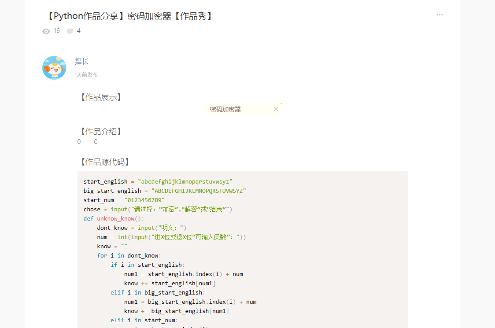

# 社区观察

## 点子
```
xiaole233:能不能做个拉屎记录器呢（已实现）
暂无投稿...
```

## 吐槽大会



xiaole233: 如果想设计更加强的现代的加密算法，我建议你读一读香农的《通信的加密原理》，这是现代密码学的开山之作


xiaole233：请移步章鱼加速器的官网的前端HTML代码（


xiaole233:输出详细的日志可以减去百分之五十的Debug困难...
