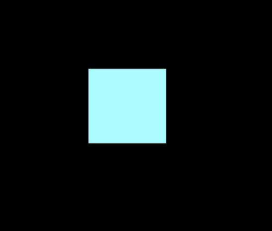
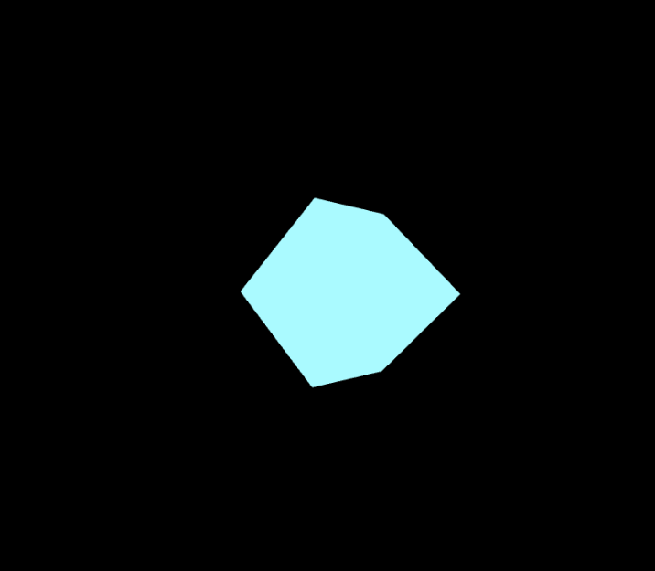
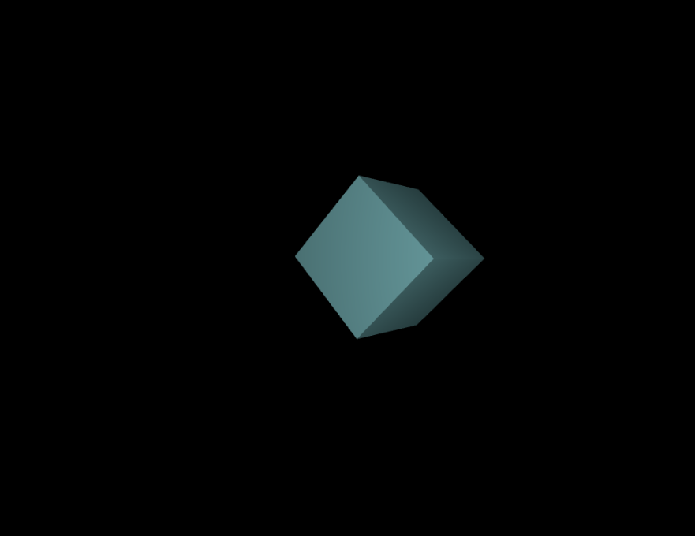

# 传火者 - Threejs 入门：做一个掉落物

虚数用 Kitten 手搓 3D 引擎，十分硬核，而我们常用的 Javascript 作为一个生态发展多年的编程语言，当然会有已经封装好的 3D 库。我们常用的 3D 库就是 Threejs，它具有轻量，便于使用的特点，而且带 3D 加速，做出来的东西要比 Kitten 手搓流畅的多。在这篇文章里我们会使用 Threejs 做一个 3D 掉落物来演示 Threejs 的基本用法

## 安装 Threejs

你可以在嵌入 HTML 的 Javascript 前加入这行代码从 unpkg 的 CDN 引入 threejs

```javascript
import * as three from https://unpkg.com/three@0.179.1/build/three.module.jshttps://unpkg.com/three@0.179.1/build/three.module.js
```

但是我不建议你用这种方式，因为你找 threejs 自带的的 addons，又需要重新去 unpkg 找 URL，我更推荐你用 npm 安装 threejs，因为这样可以搭配 vite 或 webpack 自动打包方便上线。

在安装了 nodejs 这个 Javascript 无浏览器执行环境之后会附带安装包管理器 npm，我们先用 npm 创建一个 vite 项目，我们在演示时使用 Typescript 限定类型：

```bash
$ npm create vite@latest
Need to install the following packages:
create-vite@7.0.3
Ok to proceed? (y) y


> npx
> create-vite

│
◇  Project name:
│  three-example
│
◇  Select a framework:
│  Vanilla
│
◇  Select a variant:
│  TypeScript
│
◇  Scaffolding project in /path/to/your/project
│
└  Done. Now run:

  cd three-example
  npm install
  npm run dev
```

随后进入你的项目的文件夹,运行

```bash
$ npm install #安装Vite依赖
$ npm run dev #运行Vite开发环境

> three-example@0.0.0 dev
> vite


  VITE v7.0.6  ready in 1082 ms

  ➜  Local:   http://localhost:5173/
  ➜  Network: use --host to expose
  ➜  press h + enter to show help
```

这时候你可以访问 `http://localhost:5173/`，这就是 vite 给你创建好的示例页面

然后运行

```bash
$ npm install three --save #安装threejs
$ npm install @types/three --save #如果要用TypeScript
```

这时候 Vite 会自动热重载用到了 threejs 的代码，在我们编程修改网页的代码的时候 Vite 也会自动重载并刷新浏览器，这也是使用 Vite 来做前端开发的方便之处

> 如果认为 npm 下载过慢，可以去[npmmirror 镜像站](https://npmmirror.com/)

## 把 Vite 生成的代码删干净

用你喜欢的编辑器打开你的项目的文件夹，创建好的项目结构一般长这样

```
-node_modules
├─public
│      vite.svg
│
└─src
|        counter.ts
|        main.ts
|        style.css
|        typescript.svg
|        vite-env.d.ts
- package.json
- tsconfig.json
- index.html
```

我们先打开 index.html，这是定义网站首页的骨架的 HTML 文件，我们可以修改`<title></title>`标签来修改网页的标题，然后查看 src 目录下的文件，vite-env.d.ts 显然是 vite 的配置，不用动，\*.ts 是定义网站行为的 typescript 脚本，vite 会自动把他们编译成 javascript，style.css 是定义网页样式的层叠样式表，我们可以删除 vite 自动生成的 conter.ts,style.css,删干净 main.ts。

## 创建场景

我们在 index.html 里加入

```html
<canvas id="c"></canvas>
```

这个 id 为 c 的 canvas 画布就是 threejs 的“舞台”

然后，在 main.ts 里写入：

```typescript
import * as THREE from "three";

const canvas = document.querySelector("#c") as HTMLCanvasElement; //获取舞台
const renderer = new THREE.WebGLRenderer({ antialias: true, canvas }); //创建WebGL渲染器，并打开抗锯齿，舞台为canvas
renderer.setSize(innerWidth, innerHeight); //整大一点
const camera_config = {
  fov: 75, //视场角
  aspech: 2,
  near: 0.1, //最近可见，0.1单位长度
  far: 5, //最远可见，5单位长度
};
const camera = new THREE.PerspectiveCamera(
  camera_config.fov,
  camera_config.aspech,
  camera_config.near,
  camera_config.far,
); //创建视锥透视相机
camera.position.z = 4.5; //摄像机z方向坐标为4.5
const scene = new THREE.Scene(); //创建场景

renderer.render(scene, camera); //渲染场景
```

查看页面，可以看到一片黑乎乎，这就是你创建的场景，他现在什么都没有，因此显示为一坨黑

## 增加点东西

我们从最简单的方块开始添加，在创建完场景之后，创建方块的“图元”，你可以把图元理解为 Threejs 提供的简单的模型。

```typescript
const box_geometry = new THREE.BoxGeometry(1, 1, 1); //创建一个方块模型
```

随后，创建材质：

```typescript
const box_mateiral = new THREE.MeshBasicMaterial({
  color: 0xaafaff, //设置颜色，十六进制
}); //创建方块的纹理
```

> 材质和纹理是两个概念，材质包括模型、光照等物理特性，纹理就只有贴图

最后，创建方块：

```typescript
const box = new THREE.Mesh(box_geometry, box_mateiral);
```

这时候，你打开浏览器，可以看到这样的场景：


这看起来并不像是 3D 的，我们让它旋转一下：

```typescript
box.rotateX(1);
box.rotateY(1);
```



有些 3D 的感觉了，但仍然不像是 3D，这时候，我们可以更换材质，我们此前使用的是最基本的`MeshBasicMaterial`，我们可以换用实现了最基本物理光照的`MeshPhongMaterial`

```typescript
const box_mateiral = new THREE.MeshPhongMaterial({ color: 0xaafaff });
```

再次查看网页，为何方块消失了呢？`MeshPhongMaterial`实现的是物理光照，没光当然看不到！那么，上帝也就是你说要有光，这个场景就有了光:

```typescript
const light = new THREE.PointLight(0xffffff, 15); //点光源,颜色为0xffffff白色，强度为15
light.position.z = 4.5;
scene.add(light);
```



这个方块已经看起来是一个 3D 的了。

## 加点动画

这只是一个 3D 的方块，还是有些单调了。让我们给这个方块添加一些动画。我们先创建一个 animate 函数来写动画和渲染

```typescript
const animate = () => {
  //确实可以这样在JS里写函数
  box.rotateY(0.05);
  renderer.render(scene, camera); //调用渲染
};
```

然后，就要重复调用这个函数来让这个动画持续下去。如果直接`while(true)`或者直接递归，因为 JavaScript 是单线程的，页面会直接卡住，我们需要用`requestAnimationFrame`这个 JS 内置方法来向浏览器索要动画帧，并在动画函数内递归索取动画帧来让动画持续下去：

```typescript
const animate = () => {
  //确实可以这样在JS里写函数，当然你更习惯用function也可以
  box.rotateY(0.05);
  renderer.render(scene, camera); //调用渲染
  requestAnimationFrame(animate); //递归
};
requestAnimationFrame(animate);
```

然后，就可以看到这个方块转起来了

你还可以增加一些方块在位置上的变化，`requestAnimationFrame`在执行你传入的函数的时候会附上一个 time 参数记录动画这是开始的第几毫秒，你可以在函数的参数里增加一个 time 参数来接受这个参数，然后用这个计时器去写一些动画,众所周知，正弦函数是一个波函数，可以用它写出一些循环的动画：

```typescript
// box.rotateX(0.8); //取消之前增加的X轴转动
//不用Typescript的同学就不要加类型了
const animate = (time: number) => {
  requestAnimationFrame(animate);
  renderer.render(scene, camera);
  box.position.y = Math.sin(time / 1000) / 2;
  box.rotateY(0.01);
};
requestAnimationFrame(animate);
```

再次查看网页，这个方块就会变转动边上下浮动，有掉落物那种感觉了

## 增加贴图

这个方块目前是没有贴图的，我们可以用用 TextureLoader 来增加图片贴图，然后把它他加到这个方块上：

```typescript
const box_texture = new THREE.TextureLoader().load("/path/to/your/texture");
const box_mateiral = new THREE.MeshPhongMaterial({
  color: 0xaafaff,
  map: box_texture,
});
```

然后，你的掉落物就有了贴图...
<del>不给展示了展示了虚数就要干我了</del>

## 打包，上线

如果你之前使用 Vite，那你可以用这条命令自动把你的 3D 网页打包：

```bash
$ npm run build
```

打包好的网页会被输出到 dist 目录下，如果你拥有自己的服务器，可以在服务器上安装 Nginx 之类的服务器软件来部署你的服务器，或者购买云服务商的 Serverless 服务来一键部署静态页面，然后你就能把你的网站分享给你的朋友了，可以看看我做的[Threejs 页面](https://imgainary-number-happy-site.pages.dev/),使用 Cloudflare 的免费 Serverless 服务部署，感兴趣的可以搜索一下

## 写在后面

Threejs 能做的事情还有很多，你可以查看[Threejs 的文档](https://threejs.org)，它拥有中文文档，比较详细
