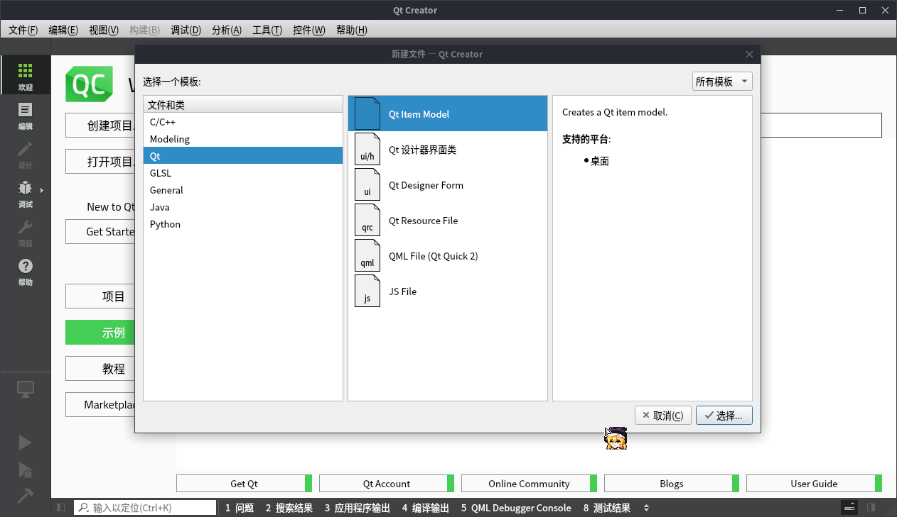
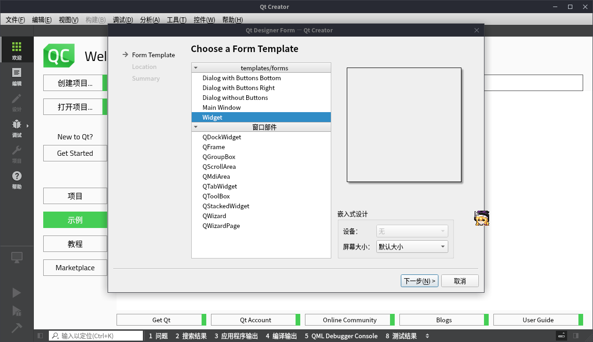
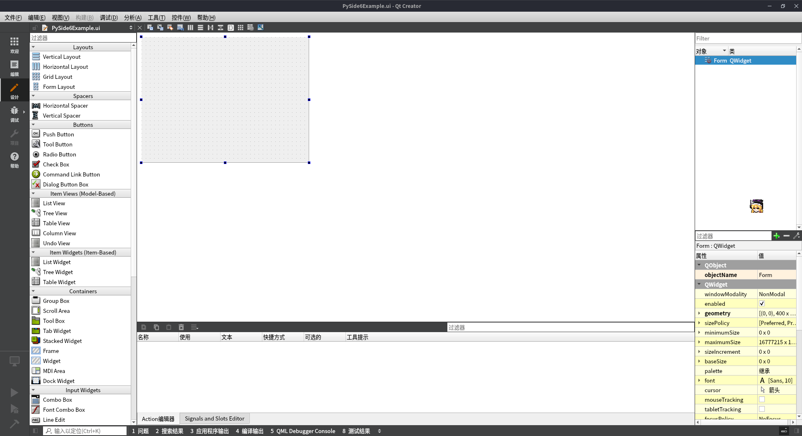
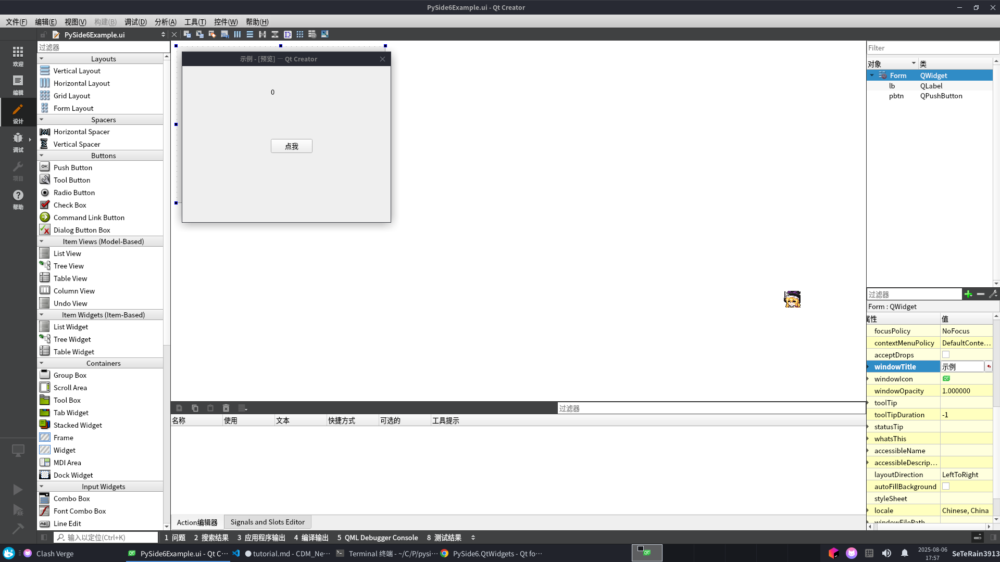

# 传火者 - PySide6 用Python构建你的Python应用

用Python构建UI界面可以使用自带的Tkinter，但Tkinter通常很难写好看，今天我们来介绍一个可以构建相对好看一些的UI库————PySide6

## Qt

Qt是一个跨平台的C++ UI库，Python是可以通过一些方式调用C/C++库的，而PySide6就是Qt的Python封装，它提供了一个相对方便的方式来构建UI界面

## 用PySide6构建你的一个应用

### 构建项目结构

首先，你需要安装Python 3.6以上的版本，打开你的终端，创建一个文件夹，它的名字就是你的PySide6项目的名字

```bash
$ mkdir pyside6-example
```

然后，建立Python虚拟环境来防止发生包冲突

```bash
$ python3 -m venv venv
$ source venv/bin/activate #bash
$ source venv/bin/activate.fish #fish
source venv/bin/activate.bat #Windows cmd
```

随后，安装PySide6

```bash
$ pip install PySide6
$ pip freeze > requirements.txt #把依赖项写进requirements.txt
```

> 这个库比较大，最好用镜像

最后，创建Python包和程序入口

```bash
$ mkdir pyside6_example
$ touch pyside6_example/__init__.py #Python包
$ touch main.py #程序入口
```

我们所做的这些目的就是构建现代化的Python项目，如果你只是想要玩一玩，单文件的Python脚本也不是不可以

## 设计UI界面

用Tkinter构建UI需要自己手写代码，PySide6也可以这样做，不过我更建议你用Qt的官方工具Qt Creator来构建UI，你可以访问这个[镜像站](https://mirrors.tuna.tsinghua.edu.cn/qt/archive/qtcreator/9.0/9.0.2/)来寻找你需要的安装包，安装需要Qt账号，我觉得你会注册，剩下的一路同意并下一步即可...

打开QtCreator,在顶栏上点击文件->New File->Qt->Qt Designer Form



> 这软件自带中文，但不完全



Templete/Form这一栏选择Widget(标准窗口)，其他不做修改，下一步,写好文件名和保存路径，下一步，版本控制系统有的话就添加，创建。



进入设计界面，左边是控件盒，中间是我们的窗口，右边是控件树与控件属性。你可以把控件拖到窗口上面，每个控件都有对应的Python类，你可以查看[PySide6 API文档](https://doc.qt.io/qtforpython-6/PySide6/QtWidgets/index.html#module-PySide6.QtWidgets)来查看各个类的使用方法

我们拖入一个Push Button按钮和一个Label文字标签，然后修改这几个控件的属性,windowTitle为“示例”，其余略...

设计完成后，保存，按<kbd>Alt</kbd>+<kbd>Shift</kbd>+<kbd>R</kbd>预览窗口



保存到你的package里，在此处使用命令把ui文件编译成Python脚本

```bash
$ pyside6-uic PySide6Example.ui > ui_PySide6Example.py
```

这样你的UI就被输出到了ui_PySide6Example.py这个PythonModule

## 展示窗口

进入**init**.py，编写

```python
from ui_PySide6Example import Ui_Form
from PySide6.QtWidgets import QWidget,QApplication
import sys

class PySide6Example(QWidget,Ui_Form):#继承QWidget和Ui_Form
    def __init__(self):
        super().__init__()
        self.setupUi(self)#挂载UI
        self.show()

if __name__=="__main__":
    app=QApplication(sys.argv)
    window=PySide6Example()
    app.exec()
```

运行**init**.py,然后就可以看到窗口

## 绑定事件

目前我们的窗口是不对各种操作进行反应，Qt使用信号与槽对操作进行响应，信号在每个QObject上，槽可以理解为方法或函数，我们可以编写一个槽函数让按钮在被惦记的时候文本标签上面的数字+1

```python
from ui_PySide6Example import Ui_Form
from PySide6.QtWidgets import QWidget,QApplication
import sys

class PySide6Example(QWidget,Ui_Form):
    count=0
    def __init__(self):
        super().__init__()
        self.setupUi(self)
        self.pbtn.clicked.connect(self.onClick)#绑定到点击这个信号上
        self.show()

    def onClick(self):#槽函数
        self.count+=1
        self.lb.setText(str(self.count))

if __name__=="__main__":
    app=QApplication(sys.argv)
    window=PySide6Example()
    app.exec()
```

## 打个包

先在项目根目录下创建setup.py,写入一下内容:

```python
from setuptools import setup,find_packages

setup(
    name='pyside6example',
    version='0.0.1',
    install_requires=[
        'pyside6',
    ],
    packages=find_packages(
        include=['pyside6_example']
    )
)
```

然后使用`python setup.py install`安装这个package

之后，写main.py

```python
from pyside6_example import PySide6Example
from PySide6.QtWidgets import QApplication
import sys

app=QApplication(sys.argv)
window=PySide6Example()
app.exec()
```

然后用pyinstaller打包:

```bash
pip install pyinstaller
pyinstaller main.py
```
